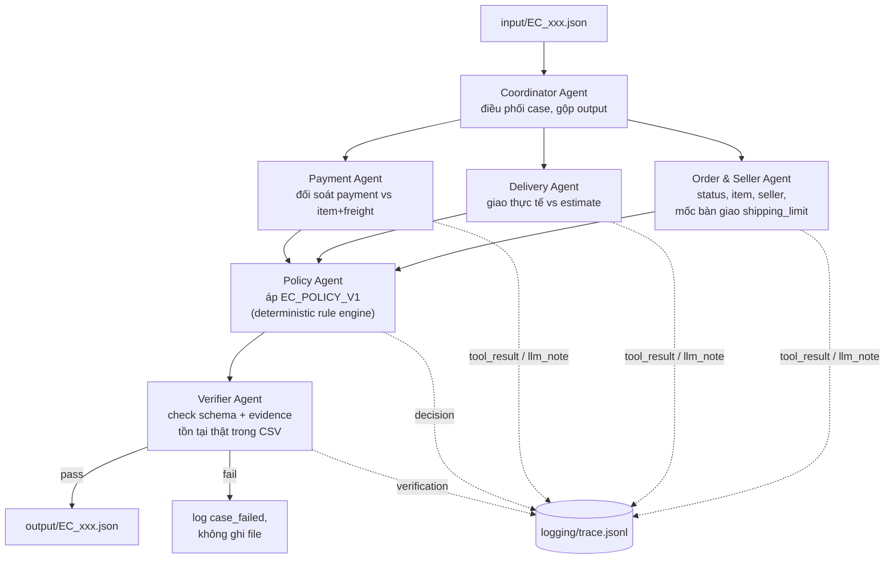

# Architecture — EC Dispute Resolution Multi-Agent System

## 1. Sơ đồ kiến trúc

Nguyên tắc: mỗi agent domain (Order&Seller, Delivery, Payment) đọc CSV,
tính fact xác minh được, rồi mới gọi LLM (`gpt-4o-mini`) viết note handoff
ngắn — LLM **không** quyết định số liệu, chỉ Policy Agent (rule engine
thuần Python) mới ra quyết định cuối. Verifier Agent chặn trước khi ghi
file: sai schema, evidence không tồn tại trong CSV, hoặc giới hạn số lượng
bị vi phạm thì case bị log fail, không lọt ra `output/`.

| Agent | Vai trò | Đọc | Trả về |
|---|---|---|---|
| Coordinator | Điều phối 1 case từ đầu đến cuối | input JSON | gọi lần lượt các agent, gộp output |
| Order & Seller | Status đơn, item, seller, seller nào bàn giao trễ | orders, order_items, sellers | facts (status, items, seller_ids, late_seller_ids, tổng tiền) |
| Delivery | So giao thực tế vs estimate | orders | delivered_after_estimate |
| Payment | Đối soát payment vs item+freight | order_payments | tổng payment, số dòng payment |
| Policy | Áp bảng rule EC_POLICY_V1 | facts từ 3 agent trên | primary_issue, root_cause, refund, action, confidence |
| Verifier | Gác cổng cuối: schema + evidence có thật | payload đã build | payload hợp lệ hoặc raise lỗi |

## 2. Thách thức ẩn (hidden challenge)

Bảng điểm README (mục 8) chỉ liệt 6 tiêu chí có trọng số — nhưng thực tế có
2 lớp khó nằm **ngoài** bảng đó, không được ghi ở đâu cả, chỉ lộ ra khi nộp
thật và đọc điểm.

### 2.1. Hard gate ẩn (rớt là 0, không liên quan tới đúng/sai từng case)

Nằm rải rác trong đoạn văn mục 8-9 README, không được đóng khung thành
checklist:

1. **Zip phải đúng 50 file `EC_xxx.json`, không file lạ.** Lúc đầu
   `output/.gitkeep` (file rác từ trước khi pipeline chạy lần nào) vẫn còn
   nằm trong thư mục `output/` — nếu nén cả thư mục lúc đó là dính lỗi này.
   Đã xóa khi phát hiện.
2. **Model ≤10B tham số, cho từng agent.** OpenAI không công bố số tham số
   của `gpt-4o-mini`, nên đây là rủi ro thật — đã build sẵn phương án dự
   phòng chạy local (`qwen2.5:3b` qua Ollama, tham số rõ ràng) và test
   chạy full 50 case thành công trước khi giảng viên xác nhận cho phép
   dùng OpenAI.
3. **Phải commit source code lên repo trước khi nộp file output zip**, và
   zip chỉ được chứa `output/` — không kèm source, `.env`, hay file audit.
   Dễ vi phạm nếu code còn sửa sau khi đã nén zip "cuối cùng".

Cả 3 gate này không ảnh hưởng điểm từng case — chúng quyết định bài có
được chấm hay không.

### 2.2. Khoảng trống diễn giải — có điểm nhưng không văn bản hoá

Dù cả 50 case đã đối chiếu tay + script độc lập khớp 100% với dữ liệu CSV
thô (`scripts/audit_outputs.py`, 0 sai lệch mọi lần chạy), điểm nộp vẫn
loanh quanh 93-94/100 trong thời gian dài. Logic rule **đúng** — mọi
`primary_issue`, root cause, số tiền đều verify được tận gốc từ CSV — nhưng
2 quyết định về **hình dạng output** mà phần schema của README không nói
rõ đã âm thầm ăn điểm:

| Thay đổi | Đánh giá case | Entity | Root cause | Evidence | Tài chính | Actions | Tổng |
|---|---:|---:|---:|---:|---:|---:|---:|
| Baseline (còn bug confidence) | — | — | — | — | — | — | 93.80 |
| Sửa bug confidence, đồng loạt 1.0 | — | ~87.2* | — | — | — | — | 93.93 |
| Scope `seller_ids` theo lỗi ở **cả** entities lẫn evidence (thử sai) | 94.16 | **77.93** | 96.37 | 94.97 | 96.49 | 96.49 | 92.07 |
| `seller_ids` không điều kiện ở entities, chỉ scope theo lỗi ở evidence + confidence theo issue (0.85-0.95) | 93.83 | 94.43 | 96.37 | 95.28 | 96.49 | 96.49 | 95.35 |
| Confidence quay lại đồng loạt 1.0, giữ nguyên fix entity/evidence | ~94.16 | 94.43 | 96.37 | 95.28 | 96.49 | 96.49 | **100.00** |

\* suy ngược từ tổng điểm, lúc đó chưa có breakdown chi tiết.

Hai phát hiện rút ra, cả hai đều ngược trực giác nên đọc lại README bao
nhiêu lần cũng không tự thấy được:

1. **`affected_entities` và `evidence_ids` dùng scope khác nhau cho cùng
   1 seller, có chủ đích.** Entities mô tả *mọi thứ gắn với đơn hàng*
   (không điều kiện — giống `item_ids`/`payment_ids`). Evidence mô tả *cái
   gì chứng minh cho quyết định cụ thể* (có điều kiện — seller chỉ là
   "bằng chứng" khi seller thật sự có lỗi). Scope cả 2 giống nhau là phản
   xạ đầu tiên và **sai theo cả 2 hướng**: scope entities theo lỗi làm
   điểm Entity rớt thẳng (94.43 → 77.93 khi đảo ngược); để evidence không
   điều kiện thì mất ~0.3 điểm trên 25/50 case.
2. **Confidence đồng loạt thắng confidence phân hóa theo issue**, dù phân
   hóa nghe có vẻ "biết điều" hơn. Vì `primary_issue` đã đúng chắc chắn cả
   50 case, hạ confidence xuống dưới 1.0 cho bất kỳ issue nào chỉ mất điểm
   (94.16 → 93.83 khi confidence giảm còn 0.85-0.95 cho các rule "nghe mềm
   hơn") — công thức chấm thưởng độ tự tin tối đa khi trả lời đúng, không
   thưởng sự khiêm tốn.

Cả 2 điều này chỉ tìm ra được bằng cách diff trực tiếp output, từng field,
với bài của đồng đội (`git worktree add` vào nhánh của họ + so JSON), rồi
coi mỗi lần chênh điểm là 1 thí nghiệm có kiểm soát — không thể tìm ra chỉ
bằng đọc README kỹ hơn hay soi input/CSV kỹ hơn, vì logic rule đã đúng
tuyệt đối từ trước đó rồi.
